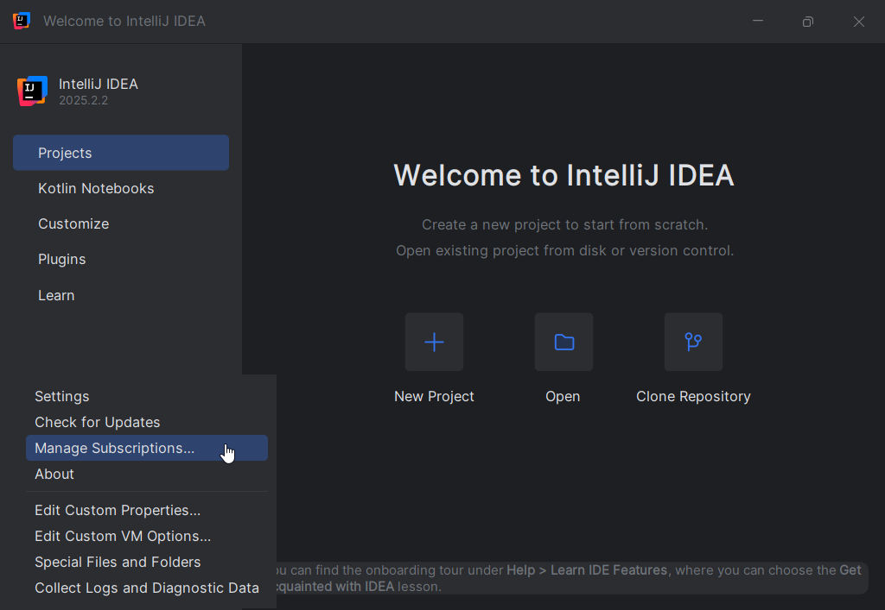
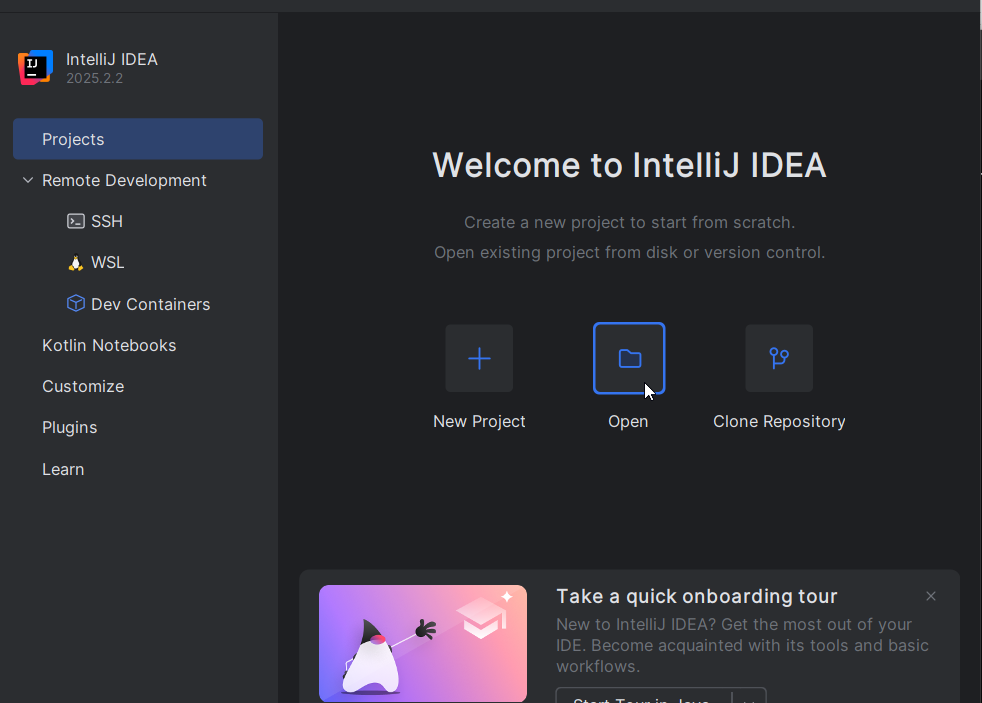
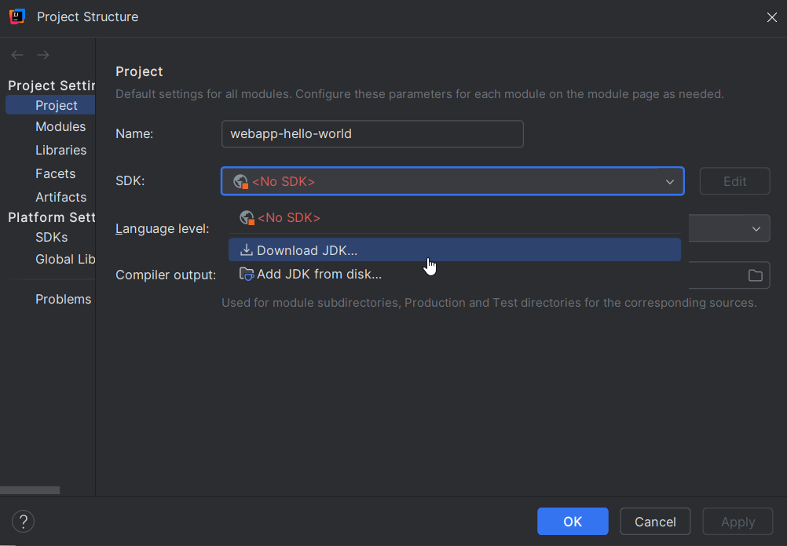
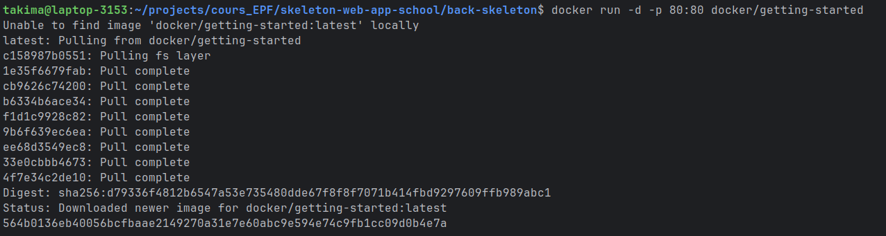
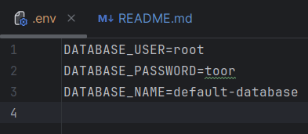
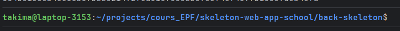
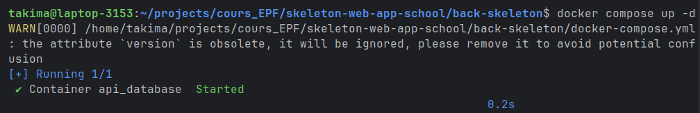
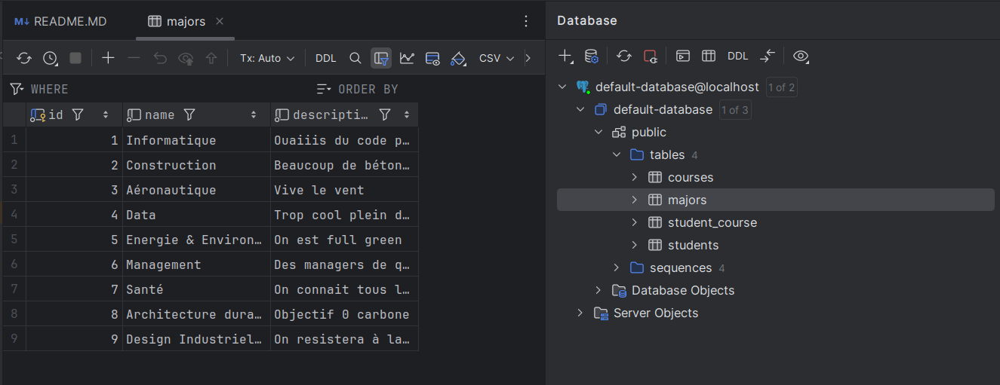
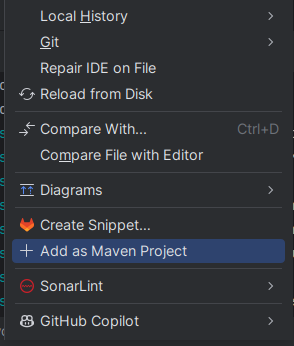
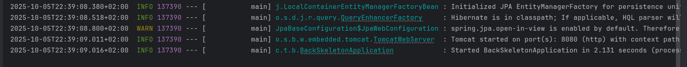

# Set up cours Java Spring Boot

## I. Installation
**2 méthodes d'installation sont possibles : par téléchargements Internet ou par Clé USB**
### Windows
#### Par téléchargements Internet :
- Docker : https://docs.docker.com/desktop/install/windows-install/
- IntelliJ : https://www.jetbrains.com/fr-fr/idea/download/#section=windows

### Mac
Pour les puces M1 ou M2, choisis *Apple Chip* & *(Apple Silicon)*  
Pour les puces Intel, choisis *Intel Chip* & *(Intel)*

#### Par téléchargements Internet :
- Docker  : https://docs.docker.com/desktop/install/mac-install/
- IntelliJ : https://www.jetbrains.com/fr-fr/idea/download/#section=mac

### Linux
#### Commandes pour les installations :
- Docker :  
  - `curl -fsSL https://get.docker.com -o get-docker.sh`  
  - `sudo sh get-docker.sh`
  - `sudo usermod -aG docker $USER`

- IntelliJ :  
  - `sudo snap install intellij-idea-ultimate --classic`

## II. Set up IntelliJ
### 1. Création compte
IntelliJ est un IDE super complet et est devenu un indispensable pour le développement de projet Java.  

Avec ses recherches de fichiers optimisées, ses auto-complétions et ses raccourcis à gogo, IntelliJ améliore grandement l'expérience de développement.
Le Graal étant que Maven y est de base intégré et que tu puisses
télécharger n'importe quelle version de Java directement depuis ton IDE (non ce n'est pas un rêve !) 

Cerise sur le gateau grâce à ton compte EPF, tu peux gratuitement obtenir une licence de la version payante (Ultimate).
Elle est essentielle au bon déroulement du TP car, avec cette dernière, tu pourras notamment visualiser ta base de données et interagir avec elle directement depuis IntelliJ.  
Pour te créer un compte, suis ce lien et effectue les actions détaillées ci-dessous : https://www.jetbrains.com/fr-fr/idea/

### 2. Licence IntelliJ
Pour récupérer une licence gratuite utilise ce lien : https://jetbrains.com/shop/eform/students

### 3. Lancer IntelliJ
Une fois ta licence récupérée, lance l'IDE et relie ton compte

### 4. Clonage du projet
Pour récupérer le repository GitLab du TP, lance `git clone https://gitlab.takima.io/formation-dev-web/skeleton-web-app-school.git` dans le dossier de ton choix

Tu y trouveras toutes les ressources nécessaires à la suite du TP.

Dans IntelliJ, ouvre dans un premier temps uniquement le dossier `back-skeleton`.

### 5. Téléchargement de Java 17
Depuis IntelliJ, tu peux directement télécharger Java 17 :  

### 6. Ouvrir un terminal dans IntelliJ
Il est très utile d'avoir un terminal ouvert pour pouvoir interagir avec le programme en ligne de commande.

 
Tu peux également changer de Shell (Surtout utile pour les Windows) 
 

 

Sélectionne *Git Bash*

## III. Set up de la BDD via Docker
### 1. Docker
Après avoir télechargé docker, lance le Docker Desktop en cliquant sur l'icône. Tu dois obtenir l'écran suivant :

Ferme et ré-ouvre ton application IntelliJ pour que les changements effectués par l'installation de Docker soit pris en compte.
 

Pour s'assurer que ton install Docker a bien fonctionné, lance la commande suivante dans ton terminal :
`docker run -d -p 80:80 docker/getting-started`

Tu dois obtenir ce résultat :
 

### 2. Définition des variables d'environnement
1. Copie-colle le `.env.sample` en `.env`
2. Remplis le fichier `.env` avec les credentials de ton choix. Ce sont les accès de ta bdd.

Il est important que ces variables restent privées. Il ne faut pas les push avec le reste de ton code :

3. Vérifie que le `.env` est bien dans le fichier .gitignore

### 3. Lancement de la BDD
Dans un terminal, place-toi si tu n'y es pas déjà à la racine du dossier back-skeleton.

Tu vas maintenant lancer le container de ta bdd. Pour ce faire, lance la commande `docker compose up -d`

Tu dois obtenir ce résultat :

Voilà ! Ta base de données est créée, mais c'est plus sympa si on peut la voir...

### 4. Afficher la BDD dans IntelliJ
<em>Attention, cette étape ne fonctionne qu'avec la version "Ultimate" de IntelliJ. Pour rappel, tu peux la demander gratuitement en tant qu'étudiant.</em>

Effectue les étapes suivantes :

Installe les drivers si besoin :

Saisie les infos (1-3), puis test la connexion à la bdd (4)

  

Si c'est valide, clique sur *Apply* (5) puis *OK*

### 5. Initialisation de la BDD
C'est cool d'avoir une BDD qui fonctionne mais c'est encore plus cool quand on peut lui insérer des données en 2 clics.
Il se trouve qu'il y a des script de peuplement SQL déjà tout prêts qui n'attendent qu'à être lancés :

Clic droit + run : 

Tadaaaam (j'avoue un peu plus que 2 clics)

## IV. Run du projet (c'est bientôt fini promis !)
Ce projet utilise Maven, qui permet de déclarer et gérer toutes ses dépendances grâce à un fichier *pom.xml*  

Il faut donc que l'IDE le détecte en tant que projet Maven. Pour ce faire, clique-droit sur le pom.xml et sélectionne l'option suivante :

Rajoute le plugin : [env-file](https://plugins.jetbrains.com/plugin/7861-envfile)

Tu peux maintenant run ton projet !  

**Deux** façons de faire :

**OU**

Ça ouvre :

Sélectionne le Java 17 préalablement téléchargé et ajoute l'option `-Xms256m -Xmx256m` (c'est pour éviter que IntelliJ mange toute ta RAM) 
 

Enfin, ajoute ton fichier `.env` comme ci-dessous (n'oublie pas d'activer les fichiers cachés)

Tu peux maintenant lancer ton application :
 

Alors ça marche ? ✨​

