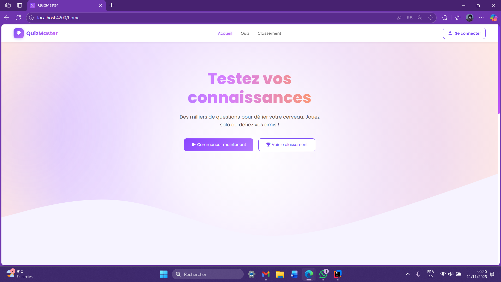
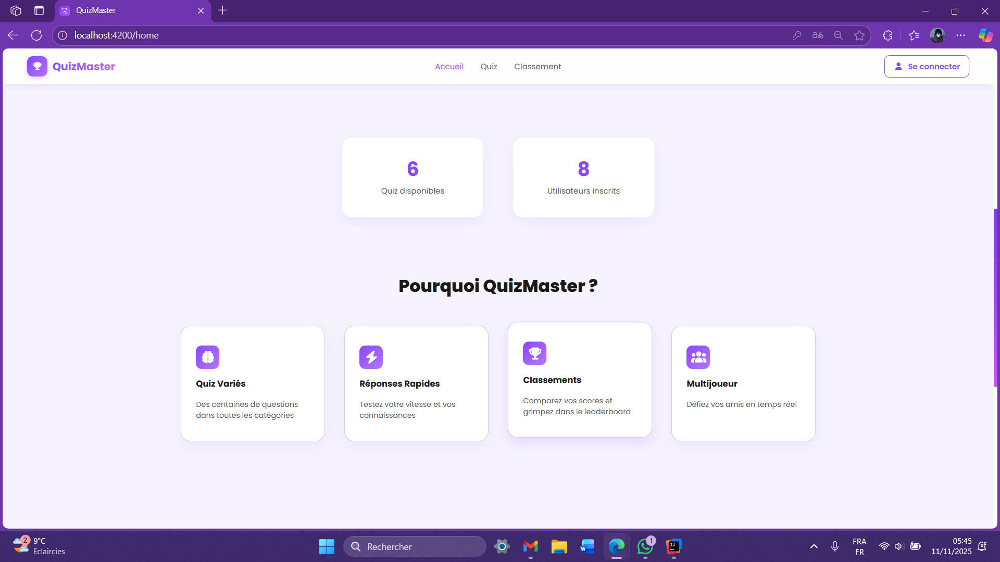
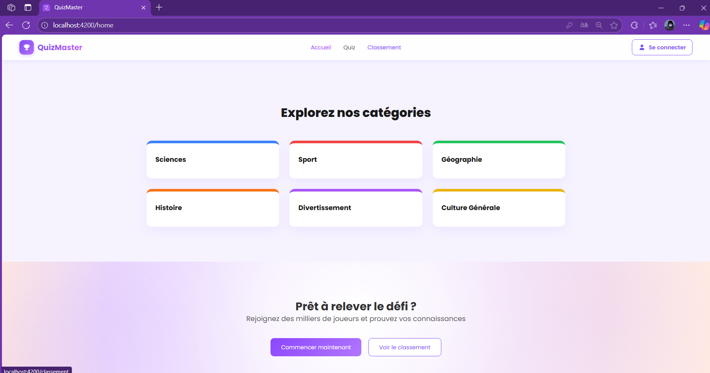
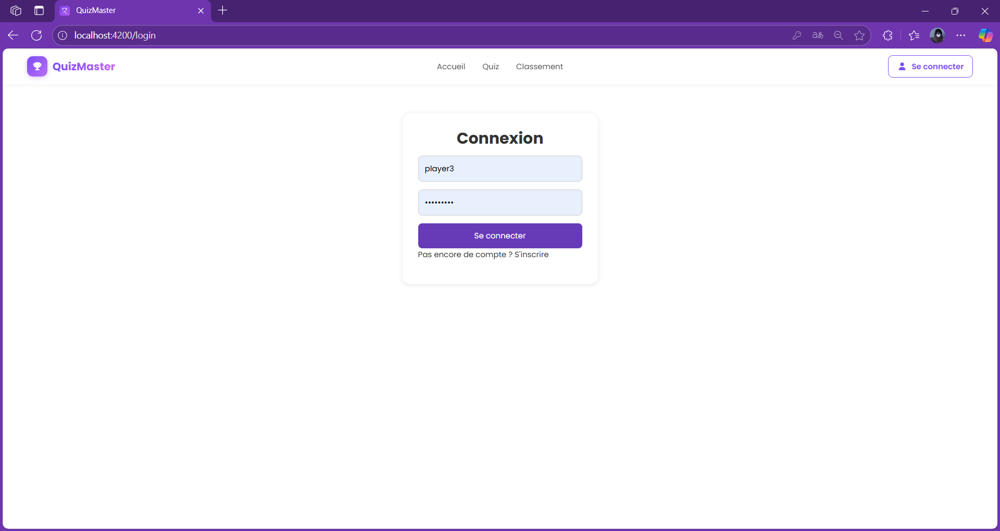
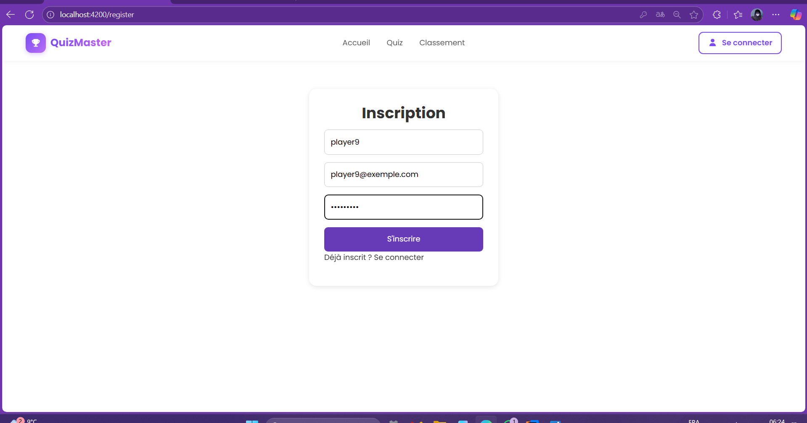
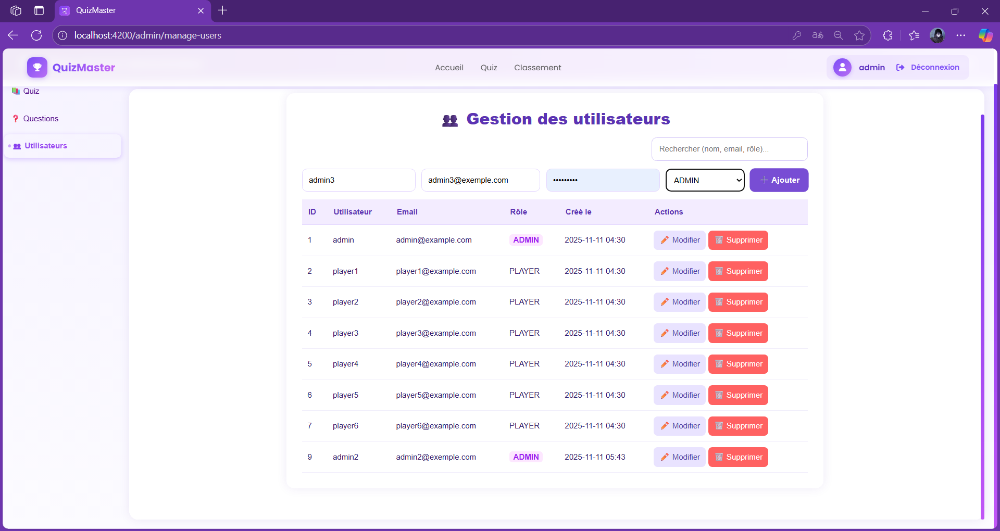
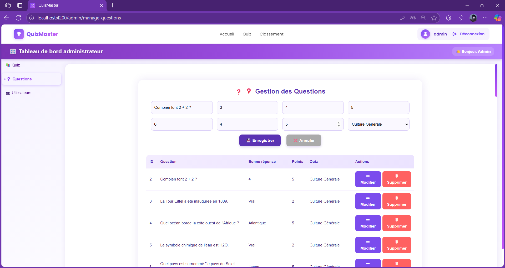
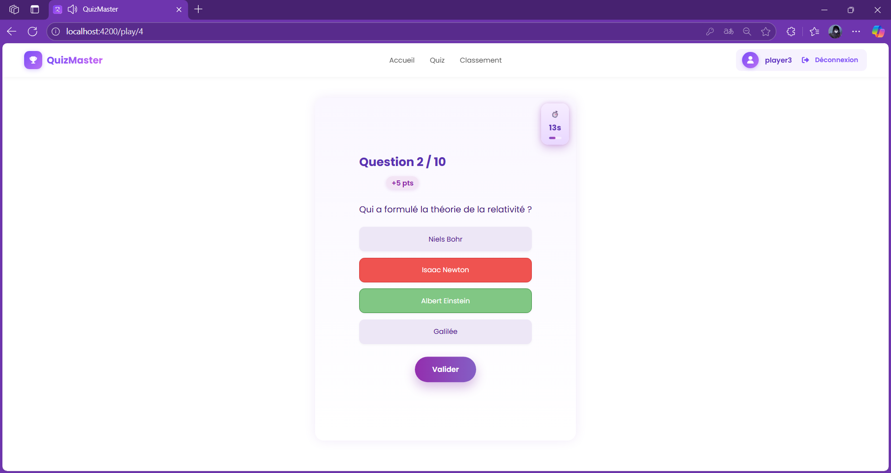
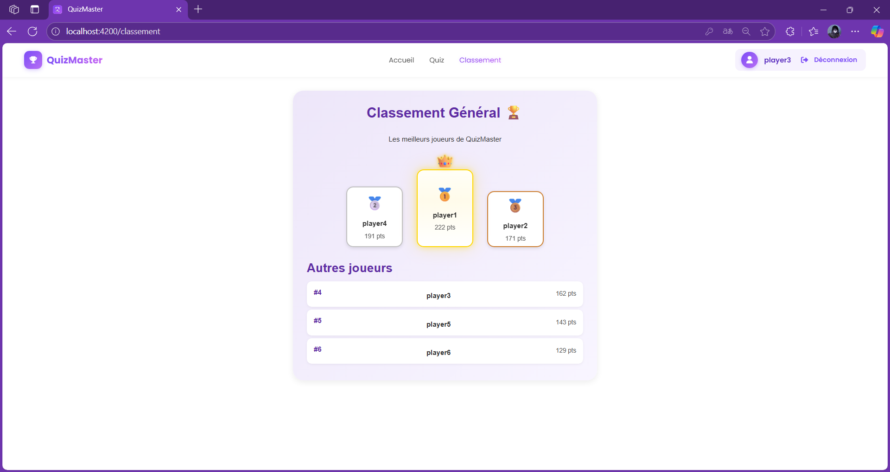
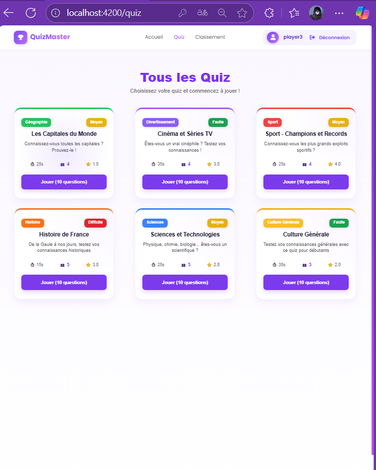

# 🧠 QuizMaster – Application Web (Java / Angular / Docker / PostgreSQL)

## 👥 Équipe

Ce projet est réalisé par :
- Safae BERRICHI
- Lamyae TALA
- Xiner GU

---

## 📋 Description du projet

QuizMaster est une application web interactive développée en Java (Spring Boot) et *Angular*, inspirée de *Kahoot!*.

L’application repose sur une architecture 3-tiers :
- **Frontend Angular** : interface utilisateur réactive et dynamique
- **Backend Spring Boot** : logique métier, gestion des utilisateurs, quiz, scores et évaluations
- **Base de données PostgreSQL** : stockage des données, conteneurisée via Docker

L’interface propose différents quiz prédéfinis classés par thèmes et niveaux de difficulté.  
Chaque joueur peut choisir :
- un sujet parmi :  
  🎬 Cinéma et Séries TV,  
  🧪 Sciences et Technologies,  
  🗺 Les Capitales du Monde,  
  🧠 Culture Générale,  
  ⚽ Sport – Champions et Records,  
  🏛 Histoire de France
- un niveau de difficulté : Facile, Moyen ou Difficile

---

### ⏱ Temps imparti selon la difficulté

| Niveau | Temps de réponse |
|:--------|:----------------|
| 🟢 Facile | 35 secondes |
| 🟡 Moyen | 25 secondes |
| 🔴 Difficile | 15 secondes |

---

### 💯 Système de score, classement et notation

Le système de score attribue des points en fonction :
- de la justesse des réponses
- et de la rapidité : plus la réponse est donnée vite, plus le score augmente.

À la fin de chaque partie :
- le joueur obtient un score individuel
- un classement général unique affiche la moyenne des scores obtenus dans tous les quiz confondus
- le joueur peut évaluer le quiz avec un système de notation (rating) sur 5 ⭐ étoiles.

Les scores, évaluations et historiques sont enregistrés dans une base de données PostgreSQL initialisée automatiquement via Docker.

---

## 🛠 Panneau d’Administration

Le panneau d’administration permet de gérer entièrement le contenu et les utilisateurs du système :

### 🎯 Gestion des Quiz
- Chaque sujet comporte 10 questions.
- Chaque question possède :
    - un énoncé clair,
    - 4 choix de réponses (dont une seule correcte),
    - et 1 ou 2 questions Vrai/Faux intégrées par sujet.
- Le temps de réponse attribué dépend du niveau de difficulté sélectionné :  
  Facile (35s), Moyen (25s), Difficile (15s).
- Les administrateurs peuvent :
    - Créer, modifier ou supprimer un quiz complet,
    - Ajouter ou supprimer des questions dans un quiz,
    - Modifier les réponses ou changer la difficulté.

### 👥 Gestion des Utilisateurs
- Possibilité de créer, modifier ou supprimer des utilisateurs.
- La suppression d’un utilisateur entraîne également la suppression automatique de ses scores et participations dans tous les quiz.
- L’administrateur peut consulter la liste complète des utilisateurs, leurs **scores moyens**, et leurs **évaluations (ratings)** laissées sur les quiz.

---

## 🗂 Architecture exacte du dépôt

```
QuizMaster/
├── back-skeleton/ # 🧠 Backend — Spring Boot (API REST)
│ ├── pom.xml
│ ├── mvnw / mvnw.cmd
│ ├── docker-compose.yml # PostgreSQL (service: api_database)
│ ├── .env.sample # DATABASE_NAME / USER / PASSWORD
│ ├── initdb/
│ │ ├── 1_TABLES.sql
│ │ ├── 2_DEFAULT_ENTRIES.sql
│ │ └── 3_SEED_QUESTIONS.sql
│ └── src/
│   └── main/
│       ├── java/com/app_quiz/backskeleton/
│       │   ├── controllers/
│       │   │   ├── AuthController.java # 🔐 login/register
│       │   │   ├── QuizController.java # 🎯 endpoints publics quiz
│       │   │   ├── QuestionController.java # ❓ endpoints publics questions
│       │   │   ├── ScoreController.java # 🏆 scores / leaderboard
│       │   │   └── admin/ # 🧑‍💻 endpoints admin (CRUD)
│       │   │       ├── QuizAdminController.java
│       │   │       ├── QuestionAdminController.java
│       │   │       └── UserAdminController.java
│       │   ├── services/
│       │   ├── DAO/
│       │   ├── models/
│       │   ├── DTO/
│       │   └── config/
│       └── resources/
│           └── application.properties # server.port=8082 + datasource
│
├── front-skeleton/ # 💻 Frontend — Angular
│ ├── package.json
│ ├── angular.json / tsconfig.json
│ └── src/
│   ├── main.ts
│   ├── index.html / styles.scss
│   └── app/
│       ├── app.module.ts
│       ├── app-routing.module.ts
│       ├── components/
│       ├── auth/
│       ├── quizzes/
│       ├── scores/
│       ├── admin/
│       ├── guards/
│       ├── models/
│       └── services/
│
├── README.md
└── .gitignore
```

---

## ⚙ Prérequis

- 🐳 Docker Desktop (ou Docker Engine)
- 🟢 Node.js ≥ 18 et npm
- ☕ Java JDK 17+ et Maven (ou mvnw fourni)

---

## 🧩 Configuration des variables d’environnement (Backend)

Créer `back-skeleton/.env` à partir de `.env.sample` :

```env
DATABASE_USER=root
DATABASE_PASSWORD=toor
DATABASE_NAME=defaultdb
```

> Le backend lit ces variables pour se connecter à PostgreSQL (voir `application.properties`).  
> Port backend par défaut : 8082

---

## ▶ Lancer le projet

### 1️⃣ Démarrer PostgreSQL avec Docker

```bash
cd back-skeleton
docker-compose up -d
```

### 2️⃣ Initialiser la base de données

```bash
docker cp initdb/1_TABLES.sql api_database:/1_TABLES.sql
docker cp initdb/2_DEFAULT_ENTRIES.sql api_database:/2_DEFAULT_ENTRIES.sql
docker cp initdb/3_SEED_QUESTIONS.sql api_database:/3_SEED_QUESTIONS.sql

docker exec -i api_database psql -U root -d defaultdb -f /1_TABLES.sql
docker exec -i api_database psql -U root -d defaultdb -f /2_DEFAULT_ENTRIES.sql
docker exec -i api_database psql -U root -d defaultdb -f /3_SEED_QUESTIONS.sql
```

### 3️⃣ Lancer le backend

```bash
./mvnw spring-boot:run
```

### 4️⃣ Lancer le frontend

```bash
cd ../front-skeleton
npm install
npm start
```

---

## 🧭 Endpoints principaux

| Contrôleur | Méthode | Endpoint | Description |
|-------------|----------|-----------|--------------|
| AuthController | POST | /auth/login | Authentification |
| UserController | GET | /users | Liste des utilisateurs |
| QuizController | GET | /quiz | Liste des quiz |
| QuestionController | GET | /questions/{id} | Questions d’un quiz |
| ScoreController | GET | /scores | Classement global |
| RatingController | POST | /ratings | Ajouter une évaluation |
| RatingController | GET | /ratings/{quizId} | Moyenne d’un quiz |

---

## 🔧 Dépannage

| Problème | Cause probable | Correctif |
|-----------|----------------|-----------|
| Connection refused localhost:5432 | Conteneur DB arrêté | docker ps / docker start api_database |
| Quiz ou scores vides | Scripts SQL non exécutés | Rejouer les 3 scripts |
| Port 8082 occupé | Process existant | Modifier server.port |
| npm start échoue | Dépendances cassées | Supprimer node_modules puis npm install |

---

## 🎥 Démonstration de l’Application

### 🏠 Page d’Accueil






### 👤 Page d’Authentification




### 🧑‍💼 Panneau d’Administration





### ❓ Exemple de Question de Quiz



### 🏆 Classement et Résultats



### 📱 Interface Responsive



---

## 📸 Conclusion

Ce projet illustre la mise en œuvre d’une architecture complète **Java – Angular – Docker – PostgreSQL** à travers une application ludique et éducative de quiz dynamique.
